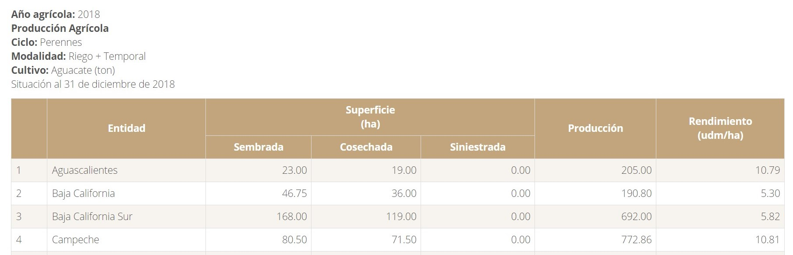
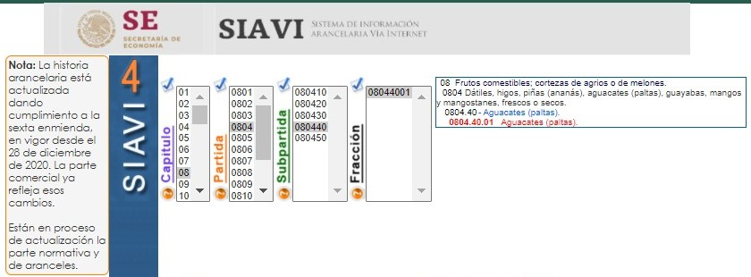
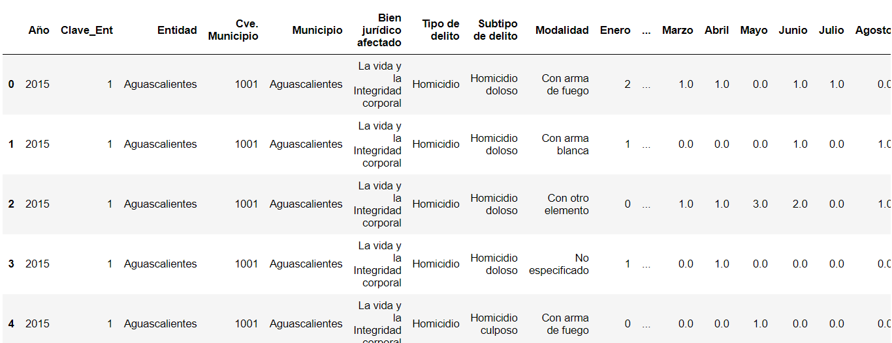
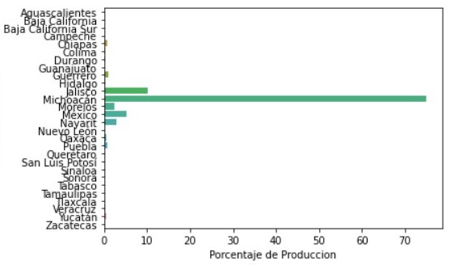
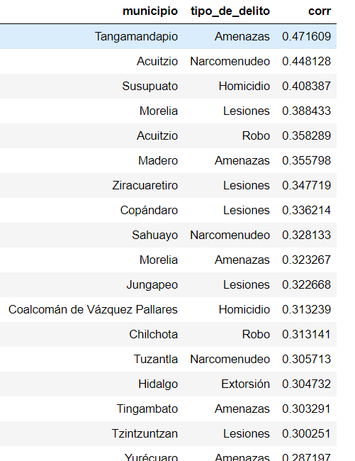
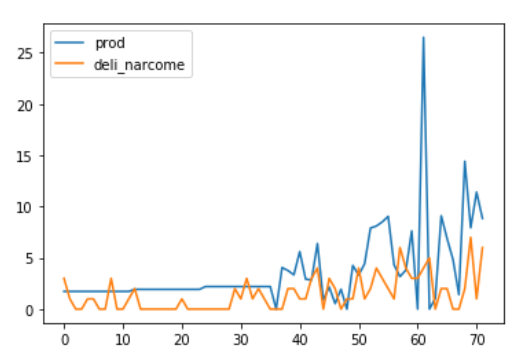
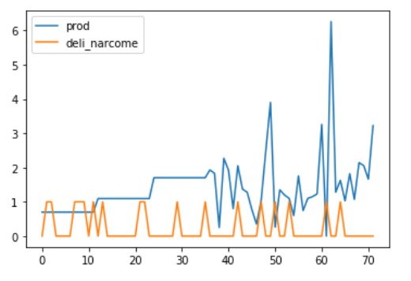
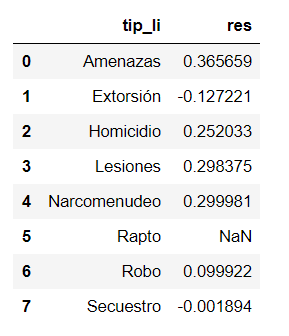
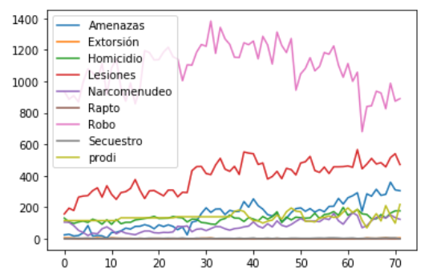

# Proyecto BEDU: Fase 2 Módulo 3

+ Luis Donaldo Romero Tapia 
+ Katherine Arzate Serrano
+ Sergio Esteban Camacho Paez
+ Jacob Hernández Mejía

---

Video Resumen: [Oro Verde. El nuevo objetivo de los carteles](https://youtu.be/xwXkJ6bqixM)

---

## 1. Identificación del problema

Actualmente México es uno de los principales exportadores de aguacate a nivel mundial. Dentro de la República Mexicana, Michoacán es el estado que más aguacates produce, 
al ser de excelente calidad se destina la mayor parte a la exportación, su producción representa más del 74% de la cosecha nacional.
Lo que muchos no saben es que la industria multimillonaria del aguacate en Michoacán se ha convertido en un objetivo para los cárteles organizados, sacando provecho de las 
ganancias de los beneficios de este producto, lo que ha ocasionado que los índices de violencia aumenten. Los criminales buscan apropiarse del control del comercio de aguacate.

“La corrupción y la impunidad son los peores enemigos de los agricultores porque en México quedan impunes los crímenes y no tienen la protección de quien debían tenerla”, 
insistió un agricultor que ha sido afectado por esta situación.

## 2. Preguntas clave

En este contexto, hay varias cuestiones que resultaría interesante conocer de esta relación, tales como:

* ¿Existirá alguna relación positiva o negativa entre la producción y la delincuencia/violencia?
* Si existe una relación, ¿qué tan fuerte?
* ¿A partir de qué momento se puede estimar con los datos el comienzo de esta relación?
* ¿En qué municipios se puede observar mayor afectación por este suceso?
* ¿Qué delito ha presentado un comportamiento que pudiera asociarse con la producción? 
* ¿Cómo será el contexto en los siguientes años a partir de la situación observada?
* ¿Habrá otros estados que pudieran verse envueltos en situaciones similares?

## 3. Datos

### 3.1 Estadística de Producción Agrícola de 1980 a 2019

El Servicio de Información Agroalimentaria y Pesquera (SIAP), proporciona resúmenes anuales de la producción agrícola por cultivo por entidad y municipio (esta categoría 
únicamente está presente desde el año 2003), la información se presenta en archivos `.csv` descargables desde la extensión de [Datos Abiertos](http://infosiap.siap.gob.mx/gobmx/datosAbiertos.php).

### 3.2 Producción mensual de aguacate de 2018 a 2020

[`Notebook`](narco_aguacate-main/notebooks/siap_asc_selenium.ipynb)

La única fuente que cuenta con información de la producción mensual es el sitio de la SIAP > Producción mensual y agrícola > [Avance de Siembras y Cosechas](https://nube.siap.gob.mx/avance_agricola/).
Esta información es la producción mensual acumulada en toneladas por entidad federativa y municipio del mes de enero de 2018 hasta el mes de enero de 2021. 

El problema con este sitio es que no existe ninguna API visible o accesible, o forma de hacer un `GET` tradicional para obtener la información, pues el sitio 
genera las consultas con JavaScript, y debido a la cantidad de consultas que requeríamos, hacer este trabajo de manera manual no era una opción viable. 

De esta manera se optó por hacer uso de la API Selenium Python, la cual nos permitió rellenar los campos del formulario iterando sobre los años y meses para
poder extraer y juntar el código HTML de las tablas generadas. El resultado se guardó para su procesamiento final. 

### 3.3 Exportaciones mensuales de aguacate de 2003 a 2020

[`Código`](narco_aguacate-main/src/siavi.py)

El Sistema de Información Arancelaria Vía Internet (SIAVI) permite obtener información en valor y volumen de las importaciones y exportaciones de México a nivel fracción de 
forma anual o mensual. Su objetivo es dar referencia sobre el comportamiento de las operaciones de comercio exterior y los antecedentes de la(s) fracción(es) desde su creación.

La forma en que se obtuvo la información mensual de esta fuente fue con el uso de requests que facilitaron la consulta de las exportaciones mensuales del aguacate, con base
en la fracción 0804.40.01 para el aguacate.

### 3.4 Reportes de incidencia delictiva

El gobierno de México provee información relacionada con la [incidencia delictiva](https://www.gob.mx/sesnsp/acciones-y-programas/datos-abiertos-de-incidencia-delictiva?state=published) a nivel nacional, donde hay información de 1997 al 2017 con la metodología antigua, y del 2015 
al 2020 con la metodología nueva, para este análisis se tomó en cuenta la base de datos echa con la metodología nueva. 

La base de datos contiene información detallada por año, entidad, municipio, el bien jurídico afectado, tipo de delito y modalidad de este, donde tiene un conteo de los delitos 
por mes.

Esta base nos será de utilidad ya que la utilizaremos como un referente de los delitos cometidos por grupos de narcotráfico, de esta manera podremos medir la relación existente 
entre la producción de aguacate y el narcotráfico.

## 4. Análisis exploratorio - Resultados principales

### 4.1 Producción Nacional 2003-2019

[`Notebook`](narco_aguacate-main/notebooks/analisisEstados.ipynb)

Gracias a los datos que se limpiaron y almacenaron en 'dfMunicipios0319.csv', podemos hacer un análisis a nivel nacional por entidad.

* Michoacán ha liderado la producción de aguacate en todo este periodo con un margen muy amplio respecto a los otros estados.
* Durante el año 2019:
  - De la producción nacional, más del 70% proviene de Michoacán.
  - Michoacán tuvo la mayor siembra, cosecha, volumen de producción y valor por producción.
  - San Luis Potosí presentó la mayor cantidad de cultivo siniestrado (dañado).
  - Jalisco se destacó por tener el mejor rendimiento.
  - Oaxaca presentó el mayor precio por el cultivo.

### 4.2 Delitos

[`Notebook`](narco_aguacate-main/notebooks/Proyecto_final_aguacates1.0.ipynb)

Teniendo las bases limpias, se busca limpiar la base de datos de delitos, la cual se filtrará para el estado de Michoacán, solo los municipios que reporten producción de 
aguacate, y por los siguientes delitos que definimos como relacionados con el narcotráfico:

* Homicidio 
* Lesiones 
* Secuestro 
* Extorsión 
* Narcomenudeo 
* Amenazas 
* Trata de personas 
* Rapto 
* Robo

Se agrupo por tipo de delito, ya que existen muchas modalidades para cada uno de los mismos. Una vez limpia la base de datos se obtuvieron las correlaciones por municipio entre 
la producción mensual y el número de reportes mensuales por tipo de delito.

De los resultados podemos observar algunos ejemplos de mucha correlación como el municipio de Tzintzuntzan con el delito de amenaza; en Pátzcuaro con narcomenudeo (0.4), 
observando que cuando hay alzas en estos delitos también lo hay en la producción de aguacate.

Por otra parte, el que tengan correlación negativa podría significar que cuando no existe el delito está en alza la producción de aguacates, mientras que cuando existe el delito 
baja la producción de aguacates. Esto hace pensar que quizá cuando no hay producción de aguacates los narcotraficantes se dedican a realizar otros actos delictivos que les 
generen remuneración.

De todo esto se concluye que existe una relación significativa a nivel estado, donde los delitos más relacionados son las amenazas, narcomenudeo, lesiones y homicidio, ¿esto cambiara algún día?

---

## Recursos

* [Planeación agrícola Nacional 2017-2030. Aguacate Mexicano](https://www.gob.mx/cms/uploads/attachment/file/257067/Potencial-Aguacate.pdf)
* [Estadistica de produccion agricola 1980-2019](http://infosiap.siap.gob.mx/gobmx/datosAbiertos.php)
* [Exportaciones mensuales 2003-2020](http://www.economia-snci.gob.mx/)
* [Producción agrícola mensual 2018-2021](https://nube.siap.gob.mx/avance_agricola/)
* [Incidencia delictiva 2015-2020](https://www.gob.mx/sesnsp/acciones-y-programas/datos-abiertos-de-incidencia-delictiva?state=published)
